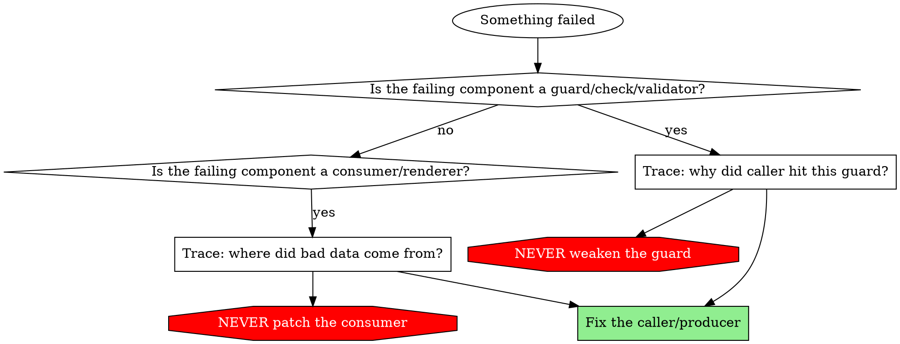

# Fix the Right Layer

## Overview

When something fails, there's always pressure to fix the thing that noticed the problem. But the thing that noticed is usually working correctly — it's the thing that *produced* the bad state that's broken.

**Core principle:** Fix producers, not consumers. Fix callers, not guards. The component that detected the failure is doing its job.

## When to Use

**Use when:**
- A guard, check, or permission blocks an operation
- A page fails because data is missing, null, or malformed
- A test fails because it encounters unexpected state
- A type error surfaces at a boundary between components

**The temptation:** Make the failing component more tolerant.
**The right move:** Find out why it received bad input.

## Two Common Anti-Patterns

### 1. Weakening Guards

A security check, permission rule, or safety guard blocks an operation. The "fix" is to relax the guard.

```
WRONG DIAGNOSIS:
  Skill writes to main branch → branch protection blocks it → "relax branch protection"

RIGHT DIAGNOSIS:
  Skill writes to main branch → branch protection blocks it → "why isn't the skill in a worktree?"
```

**The guard is working correctly.** The caller is operating in the wrong context.

Examples of guards you must never weaken as a fix:
- Branch protection checks
- File write permission rules in `settings.json`
- Environment validation (refusing operations outside tmpdir)
- Authentication/authorization checks
- Type constraints that reject invalid data

**If the only path forward appears to be weakening a security boundary, STOP and ask the user.** Explain what guard is blocking, why the operation is hitting it, and propose a root-cause fix instead.

### 2. Patching Consumers for Bad Data

Data shows up null, missing, or malformed. The "fix" is to make the renderer/UI/consumer tolerate it.

```
WRONG DIAGNOSIS:
  Page crashes on null score → "add ?? 'N/A' fallback in the template"

RIGHT DIAGNOSIS:
  Page crashes on null score → "why was a null score written to the database?"
```

**The renderer is working correctly.** The data contract says scores are numbers, and a null score means something upstream wrote bad data.

Examples of consumer patches you must not apply without investigating the producer:
- Adding `?? 'N/A'` or `value || fallback` to mask missing data
- Making fields optional in types to match broken runtime data
- Adding null checks in rendering code when the data layer guarantees non-null
- Wrapping components in try/catch to swallow data errors
- Adding "no data available" empty states for data that should always exist

## The Decision Process



## Relationship to Other Techniques

- **`root-cause-tracing.md`** tells you HOW to trace backward through the call chain
- **`defense-in-depth.md`** tells you how to add validation at multiple layers AFTER fixing the root cause
- **This document** tells you WHERE to apply the fix — always at the producer/caller, never at the consumer/guard
